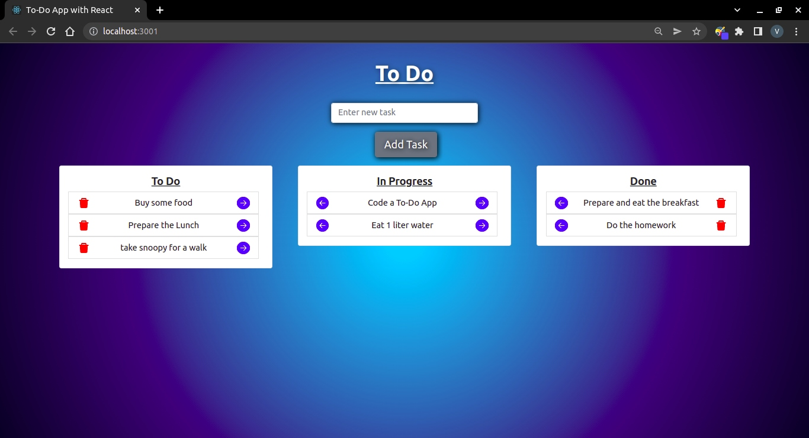

# TO_DO

<a href="https://vicmescan.github.io/to-do/">https://vicmescan.github.io/to-do/</a>
  

This is a typical to-do application created with React and Bootstrap. 

It consists of a component to enter the task and three list components where tasks can be passed from one to another and/or deleted.

I've used libraries like react-icon to make it prettier and more user friendly.

by the way, I'am still trying to eat 1 liter water...

